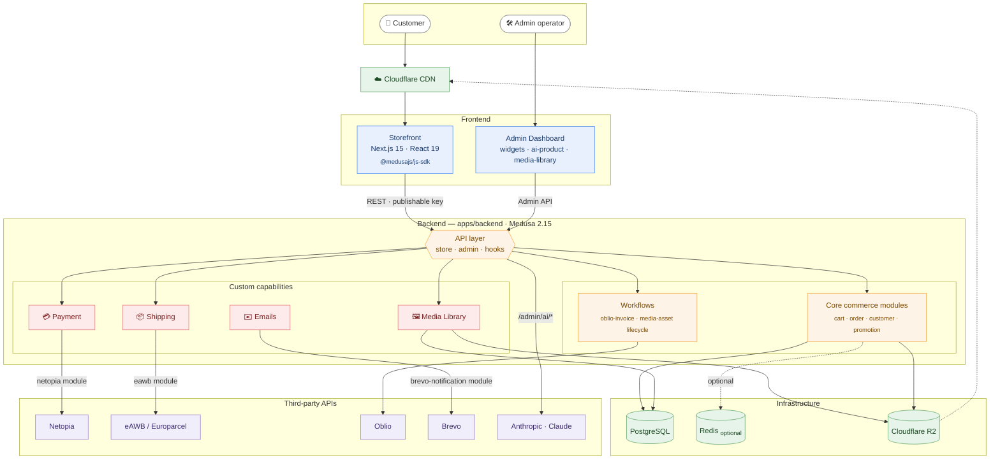
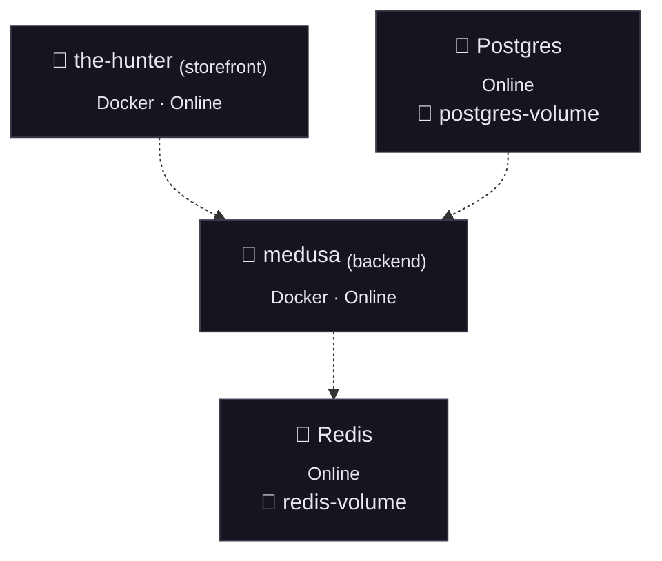

# The Hunter House — Commerce Platform

I designed and built this commerce platform solo for **The Hunter House**, a Romanian luxury menswear D2C brand: a full e-commerce system on [Medusa 2.x](https://docs.medusajs.com) and Next.js 15, with local courier fulfillment (eAWB/Europarcel), local payments (Netopia), local e-invoicing (Oblio), an AI-assisted product creation workflow, and a custom media library. It's currently running on staging, ahead of production launch.

A guiding constraint throughout: the admin should be able to customize almost anything — copy, categories, collections, tags, shipping rules, payment/notification providers — from the dashboard, without needing a code change or a redeploy for routine changes. Deploys are reserved for actual feature work, not day-to-day store operation.

I wrote this README as an engineering artifact — architecture, infrastructure, the decisions behind them, and their trade-offs — not just how to boot it.

## Live Demo

|                      | URL                                         |
| -------------------- | ------------------------------------------- |
| Storefront (staging) | [the-hunter-staging.up.railway.app](https://the-hunter-staging.up.railway.app) |
| Admin dashboard      | Available as a demo video on request — the admin runs against real staging data, so it isn't exposed publicly. |

## Contents

- [Live Demo](#live-demo)
- [Architecture](#architecture)
- [Infrastructure](#infrastructure)
- [Design Decisions & Trade-offs](#design-decisions--trade-offs)
- [Challenges](#challenges)
- [Security Notes](#security-notes)
- [Known Limitations](#known-limitations)
- [Running Locally](#running-locally)
- [Roadmap](#roadmap)

## Architecture



Turborepo monorepo, two deployable apps sharing no runtime code (communication is HTTP-only, via the Medusa REST/Admin API):

```
apps/
  backend/      Medusa 2.15 server — commerce engine, admin dashboard, custom modules
  storefront/   Next.js 15 (App Router) storefront — React 19, Tailwind, server components
```

### Backend (`apps/backend`)

Built on Medusa's modular architecture: framework-provided commerce modules (cart, order, customer, promotion, fulfillment, payment...) extended with custom modules and workflows that plug into the same dependency-injection container and event/workflow engine.

```
src/
  modules/            custom Medusa modules (see below)
  api/                custom REST routes (admin/, store/, hooks/)
  workflows/          custom Medusa workflows + steps
  subscribers/        event listeners (order/customer lifecycle)
  admin/              custom Admin dashboard widgets & pages (React, Medusa Admin SDK)
  jobs/                scheduled jobs
  links/               module links (cross-module data associations)
  lib/, scripts/, migration-scripts/
```

**Custom modules:**

| Module               | Responsibility                                                                                                               |
| -------------------- | ---------------------------------------------------------------------------------------------------------------------------- |
| `netopia`            | Payment provider for Netopia (Romanian card payment gateway) — session creation, capture, webhook verification               |
| `eawb`               | Fulfillment provider for eAWB/Europarcel (Romanian courier network) — label generation, locker lookup, shipping price quotes |
| `brevo-notification` | Notification provider sending transactional email via Brevo, replacing Medusa's default provider                             |
| `media-library`      | Standalone module with its own data model for a reusable, admin-managed asset library (decoupled from product images)        |

**Custom API surface:**

- `store/eawb/{lockers,shipping-prices}` — checkout-time locker selection and live shipping quotes
- `store/netopia/session-cart` — payment session bootstrap
- `hooks/netopia`, `hooks/netopia/complete` — payment gateway webhook + redirect handler
- `admin/eawb/{fulfill,label,order-status}` — courier operations from the order view
- `admin/oblio/[id]` — Romanian e-invoice generation/retrieval
- `admin/ai/{generate-product,preview-token}` — AI-assisted product authoring (Anthropic SDK) — see [AI Product Generation](#ai-product-generation) below
- `admin/media-library`, `store/preview/products`, `store/contact`, `store/newsletter`, `store/orders/[id]`

**Custom workflows** (Medusa's orchestration layer — steps with built-in compensation/rollback):

- `create-oblio-invoice` — fetches an Oblio auth token, creates the invoice, downloads the PDF, and persists the reference on order metadata, as one compensable unit
- `upsert-media-asset-metadata` / `delete-media-asset-permanent` — lifecycle management for the media library, kept out of the request path

**Admin dashboard customizations:** widgets injected into the stock order/product views (`order-eawb-label`, `order-oblio-invoice`, `product-preview`) rather than a parallel UI, plus two standalone pages (`ai-product`, `media-library`) for flows that don't map to an existing Medusa entity view.

### AI Product Generation

This is the feature that sets this platform apart from an off-the-shelf storefront: a custom admin page (`admin/routes/ai-product`) turns a batch of product photos into ready-to-review Medusa products — copy, variants, prices, stock, per-variant image assignment — via `POST /admin/ai/generate-product` (Claude `claude-sonnet-4-6`).

**Flow:** CSV import or manual rows → images uploaded and downscaled to webp → one vision call per row (Romanian brand-voice prompt) returns title/description/SEO/category/collection/tags/price/colors+hex/image ordering/variant-to-image grouping as JSON → the server re-validates every field against real store data rather than trusting the model as-is (category/collection/tags must match existing values, image ordering must be a true permutation) → the admin page builds the product (variant matrix, SKUs, images, stock), retrying on SKU/handle collisions → created as a **draft** with a signed preview link, never auto-published.

**Why it's built this way:** one large vision call per row instead of a multi-call pipeline, since copy, colors, and image grouping are too entangled to split cheaply; server-side validation because the model's JSON is reliable in shape but not correctness; bounded batches of 5 to respect rate limits; everything lands as a draft because AI output is a first pass, not a publish pipeline.

### Storefront (`apps/storefront`)

Next.js 15 / React 19, talking to the backend exclusively through `@medusajs/js-sdk` and the publishable API key — no direct DB or backend-internal access. Tailwind CSS for styling, Radix for accessible primitives, Framer Motion for transitions, Stripe.js wired in as an alternate payment path alongside Netopia.

## Infrastructure

### Railway topology

Four services on Railway, plus Cloudflare R2 for file storage and a Cloudflare CDN layer in front of it:



Cloudflare R2 (file storage) and Cloudflare CDN sit outside Railway — the backend talks to R2 over its S3-compatible API, with the CDN layered in front of R2 for public asset delivery.

- **Database:** PostgreSQL, via `DATABASE_URL`.
- **Cache / event bus / workflow engine / locking / sessions:** Redis-backed in production via `REDIS_URL` — `medusa-config.ts` swaps all four subsystems to their Redis implementations in one config branch; only local dev without `REDIS_URL` set falls back to in-memory.
- **File storage:** Cloudflare R2 via `@medusajs/file-s3` (S3-compatible API) when `S3_*` credentials are present; falls back to local disk otherwise, so local dev doesn't require an R2 bucket.
- **Payments / fulfillment / notifications:** each third-party module is registered in `medusa-config.ts` conditionally on its required env vars being present — the app boots in a degraded-but-functional state without any of them (manual fulfillment and the default notification provider always remain available as a floor).
- **Deployment:** both the backend and storefront run as separate Docker containers on Railway, in the same Europe region, communicating over Railway's private network URLs rather than the public internet — lower latency and no egress cost between the two. The storefront originally deployed on Netlify; it moved to Railway specifically to sit next to the backend on that private network (`netlify.toml` is a leftover from that earlier setup and is no longer used). The backend's multi-stage `Dockerfile` (Node 20-slim) builds the server and its Vite-bundled admin dashboard, prunes to production dependencies, and runs `npm run start`; comments in the file reference Railway's pre-deploy migration hook and `BACKEND_URL`/`VITE_STOREFRONT_URL` build args.

## Design Decisions & Trade-offs

- **No-redeploy admin operation.** The AI product generator, media library, category/collection/tag management, and per-order eAWB/Oblio actions all run entirely from the admin dashboard — nothing about routine store operation (adding a product, changing shipping/payment provider credentials, swapping a courier or payment provider) requires a code change. Deploys are reserved for actual feature work. The trade-off is more logic living in admin-editable config and data rather than code — correct for a store where the person running day-to-day operations isn't a developer, but it does mean provider config bugs surface at runtime, in production, rather than at build time.
- **Provider isolation over hard dependencies** — Netopia, eAWB, and R2 storage load conditionally on env-var presence, easing local/staging setup at the cost of implicit ("missing var = different provider") rather than explicit config.
- **Workflows for multi-step side effects** — Oblio invoicing (auth → create → PDF → DB write) runs as a Medusa workflow for free step-level compensation, versus hand-rolled try/catch for a simpler function.
- **In-memory infra as the local-dev default, Redis in every real environment** — one config branch on `REDIS_URL` swaps cache/events/workflow-engine/sessions to Redis-backed implementations, so local dev stays dependency-light while staging/production always run against the real Redis service on Railway.

## Challenges

Two constraints shaped most of the infrastructure decisions above:

- **Cost efficiency.** The whole stack (backend, storefront, Postgres, Redis) runs on a handful of small Railway services rather than managed equivalents (RDS, ElastiCache, a CDN vendor) — a deliberate trade of some ops convenience for a monthly bill that fits a small D2C store, not an enterprise budget. It's also why storage went to Cloudflare R2 instead of S3: same API, no egress fees.
- **No prior DevOps background.** This infrastructure — Docker builds, Railway service wiring, env-var-gated provider fallbacks, Redis-backed session/cache/workflow config — was built up without a DevOps or SRE background going in. That's also the honest source of some of the [Known Limitations](#known-limitations) below and [Roadmap](#roadmap) items (no CI, no local Compose stack, config that fails silently instead of loudly): they're the corners a solo, self-taught setup cuts first, not blind spots that went unnoticed.

## Security Notes

Not an exhaustive pentest — the points worth being explicit about:

- **No secrets in version control**, verified against full git history: no `.env` was ever committed, and `.env.template` ships with every field blank.
- **[`admin/ai/generate-product`](apps/backend/src/api/admin/ai/generate-product/route.ts:75) does a server-side `fetch()` on attacker-suppliable URLs** — admin-gated today, but a latent SSRF vector if that route is ever reused in a less-trusted context.
- **Netopia's IPN webhook (`hooks/netopia`) is intentionally unauthenticated at the network level** — its integrity relies entirely on the RSA signature check inside the handler.
- **No rate limiting** on custom routes, including the Anthropic-backed AI route and the public contact/newsletter endpoints (reCAPTCHA is the only current defense there).

## Known Limitations

- **AI-generated product data is validated for shape, not correctness** — price, category, and variant grouping are model guesses; everything lands as a draft, but nothing forces a review before publish.
- **Redis-backed scaling path is unverified** under an actual multi-instance deployment.

## Running Locally

**Prerequisites:** Node.js 20+, PostgreSQL 15+, npm 10+.

```bash
git clone <this-repo-url>
cd medusa-store
npm install

# Backend
cp apps/backend/.env.template apps/backend/.env
# set DATABASE_URL in apps/backend/.env, then:
cd apps/backend
npm run medusa db:migrate
npm run medusa user -e admin@example.com -p supersecret
cd ../..

# Storefront
cp apps/storefront/.env.template apps/storefront/.env.local
# set NEXT_PUBLIC_MEDUSA_PUBLISHABLE_KEY after retrieving it from the admin dashboard

npm run dev   # runs backend (localhost:9000) and storefront (localhost:8000) via Turborepo
```

Admin dashboard: `http://localhost:9000/app`. Publishable API keys live under Settings → Publishable API keys.

To enable an optional integration, add its env vars to `apps/backend/.env` (Netopia: `NETOPIA_SECRET`, `NETOPIA_ID`; eAWB: eAWB `api_key` config; S3/R2: `S3_*`; Redis: `REDIS_URL`) and restart — `medusa-config.ts` picks each up automatically.

## Roadmap

- **CI pipeline** — no automated lint/test/build gate on PRs yet; add GitHub Actions running `turbo lint test build` before merge.
- **Automated tests** — `turbo test` is wired at the root but the backend has no meaningful test coverage on the custom modules/workflows (Netopia webhook handling and Oblio invoice generation are the highest-value first targets given their side effects).
- **Explicit feature flags** — replace the implicit "provider loads if its env vars exist" pattern with a documented, single source of truth for which integrations are active per environment.
- **Docker Compose for local dev** — currently only a production Dockerfile exists; no one-command local Postgres/Redis stack.
- **Multi-instance readiness audit** — confirm session, cache, and workflow-engine behavior under `REDIS_URL` in a real multi-instance deployment, not just config review.
- **Remove insecure default fallbacks for session-signing secrets** — `JWT_SECRET`/`COOKIE_SECRET` should fail startup in production when unset rather than silently falling back to a built-in default.

## License

Proprietary — this is The Hunter House's codebase. The source is shown here for portfolio/demonstration purposes; see [LICENSE](LICENSE) for terms. No permission is granted to reuse, copy, or redistribute it.
